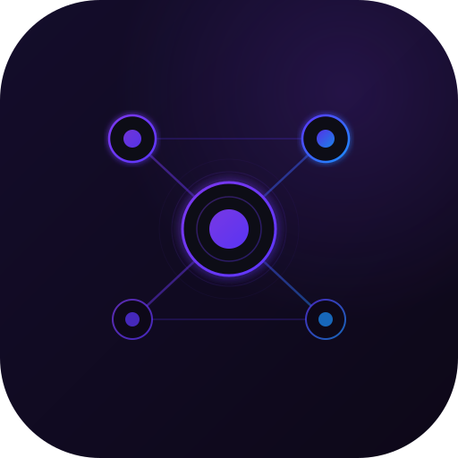
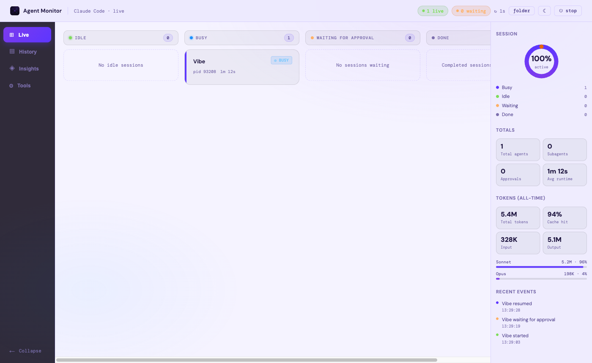

<h1 align="center">
  <br/>
  Agent Monitor
</h1>

<p align="center">A local web UI that reads Claude Code's own state files and shows all active sessions and their subagent tasks on a live Kanban board.</p>

<p align="center">
  
</p>

## What it shows

- **Idle** — sessions running but not actively processing
- **Busy** — sessions actively working
- **Waiting for Approval** — sessions paused at a tool permission prompt
- **Done** — sessions whose process has exited
- Subagent tasks nested under each session card
- Right panel: donut chart, totals grid, all-time token usage with per-model breakdown, live event feed
- **History tab**: past sessions grouped by date with turn count, conversation summary, and one-click launch
- **Insights tab**: your `/insights` report embedded inline — staleness banner after 7 days
- **Tools tab**: all MCP servers and skills available in your Claude Code installation
- **Graph tab**: knowledge wiki compiled from past sessions — concept graph, article reader, session drill-down, and Q&A

Updates every second via Server-Sent Events.

## Session name display

Sessions are identified by **folder name** by default (the working directory basename).

If you have renamed a session with `/rename` in Claude Code, a **folder / /rename** toggle button in the top shell bar switches the display to your custom title. The toggle applies to both the live Kanban board and the History tab simultaneously. The preference is saved to `localStorage`.

- Sessions **with** a `/rename` title show the other identifier as a subtitle so neither is lost.
- Sessions **without** a `/rename` title always show the folder name, regardless of the toggle setting.

## History tab

Past sessions are grouped by date. Each row shows:

- **Session name** — folder name or `/rename` title depending on the toggle
- **Turn count** — number of actual user messages in the conversation
- **copy cmd** — copies a `cd … && claude --resume …` command to your clipboard
- **launch in terminal** — opens a new terminal tab and resumes the session (macOS: Terminal.app or iTerm2; Windows: Windows Terminal, cmd, or PowerShell)
- **vscode** — opens the project folder in a new VS Code window (shown when `code` is on your PATH or VS Code is installed in `/Applications`). Note: only opens the folder — it does not resume the Claude session; use the terminal buttons or copy cmd to resume.
- **▸ summary** — expands an inline panel showing what the conversation was about, extracted from the session file without any LLM calls (prefers Claude's own phase-completion notes, falls back to the last user message)

## Insights tab

Run `/insights` in any Claude Code session to generate `~/.claude/usage-data/report.html`. Open the **Insights** tab in Agent Monitor to view the report. A yellow banner appears when the report is older than 7 days — click **↻ refresh** after re-running `/insights` to reload it.

## Tools tab

A read-only reference panel showing everything available in your Claude Code installation:

**MCP Servers** — each configured server from `~/.claude/settings.json` with its transport type (`stdio` or `http`), command/URL, and arguments. Click the args line to expand the full path.

**Skills** — split into two subsections:
- **User** — skills you've authored in `~/.claude/skills/`
- **Built-in** — skills from installed plugins (`~/.claude/plugins/`), each tagged with the plugin name (e.g. `superpowers`, `frontend-design`)

## Graph tab (Knowledge Wiki)

Compiles a personal knowledge wiki from your past Claude Code session summaries using an LLM, then renders it as an interactive force-directed concept graph.

> **Inspiration:** Andrej Karpathy proposed in a [2025 tweet](https://x.com/karpathy/status/1886192184808149360) the idea of using LLMs to build personal knowledge bases from accumulated notes and conversations — identify recurring concepts, write a short article per concept, and link related ones together to form a navigable wiki. This tab applies that idea directly to your Claude Code history: each past session summary becomes source material, the LLM extracts recurring concepts and writes articles, and the result is rendered as a force-directed concept graph with an article reader and Q&A.

### How it works

1. Click **Compile wiki** — Agent Monitor reads past session summaries (sessions without any extractable summary are skipped; sessions are ranked by summary richness and the input is capped at 80,000 characters, so the most informative sessions always make it in) and sends them to Claude via the Claude Code CLI, which identifies recurring concepts, writes a 2–3 paragraph article per concept, and links related concepts together.
2. The compiled wiki is saved to `~/.claude/agent-monitor-wiki/` as Markdown articles + a `wiki.json` graph index.
3. The Graph tab renders the concepts as a force-directed network. Nodes are coloured by cluster (Louvain community detection). Click any node to open its article in a side panel.

### Article panel

Clicking a concept node opens a panel with two views toggled by pills in the header:

- **Article** — the compiled Markdown article with clickable `[[backlink]]` navigation between concepts
- **Sessions (N)** — the past sessions that contributed to the concept, showing name, working directory, turn count, date, and a summary snippet

Close the panel with the **✕** button — the graph returns to full width.

### Q&A

The bar at the bottom of the Graph tab lets you ask free-text questions answered from wiki content only. Concept references in answers are rendered as clickable backlinks that open the relevant article.

### Graph tab badge

A small dot appears on the **Graph** nav tab when new sessions have been added since the last compile — a prompt to recompile and incorporate recent work.

### LLM access

Compiling and Q&A run on a **local model through [Ollama](https://ollama.com)** (`/api/chat` on `http://127.0.0.1:11434`) — session summaries never leave your machine.

```bash
ollama pull gemma4:12b
```

If Ollama isn't running or the model isn't pulled, the Graph tab shows a setup hint with a *re-check* link. On a CPU a compile takes several minutes. Optional environment variables (set before starting the app):

| Variable | Default | Purpose |
|---|---|---|
| `AGENT_MONITOR_MODEL` | `gemma4:12b` | Any Ollama model, e.g. `gemma4:e4b` (smaller/faster) or a `-cloud` model (sends data off-machine) |
| `AGENT_MONITOR_NUM_CTX` | `16384` | Context window in tokens (Ollama's own default of 4096 would silently truncate) |
| `AGENT_MONITOR_OLLAMA_URL` | `http://127.0.0.1:11434` | Ollama server address |

The Claude Code CLI is still used for the History tab's *resume* buttons.

## Token usage

The right panel aggregates all-time token usage from `~/.claude/projects/` and shows total tokens, cache hit rate, input/output split, and a per-model bar chart (Opus / Sonnet / Haiku).

## Dark / Light mode

Click the **☀ / ☾** toggle in the top-right shell bar. Preference is saved to `localStorage` and defaults to your OS setting.

## Resuming sessions

Completed sessions (in the **Done** column) and past sessions (in the **History** tab) offer three options:

- **copy cmd** — copies the resume command to paste in any terminal
- **launch in terminal** — directly opens a new terminal tab with the session resumed (no copy-paste needed)
- **vscode** — opens the project folder in a new VS Code window (requires `code` on your PATH or VS Code in `/Applications`; shown automatically when available). Note: only opens the folder — it does not resume the Claude session; use the terminal buttons or copy cmd to resume.

## Requirements

- Node.js 18+
- Claude Code running at least one session (writes `~/.claude/sessions/`)
- For the Graph tab: [Ollama](https://ollama.com) with a pulled model (`ollama pull gemma4:12b`; ~8 GB, 16 GB RAM recommended)

## Quick start

```bash
git clone https://github.com/prasanth23590/AgentMonitor.git
cd AgentMonitor
npm install
npm run dev
```

Open [http://localhost:5173](http://localhost:5173).

## Windows desktop app

Build an installer and run Agent Monitor in its own window (no browser, no terminal):

```bash
npm install
npm run icon   # once: generates assets/icon.ico from assets/icon.svg
npm run dist   # builds dist-app/Agent Monitor Setup 1.0.0.exe
```

Run the installer, then launch **Agent Monitor** from the Start menu. The installer is unsigned, so Windows SmartScreen will warn the first time. Closing the window — or the **⏻ stop** button — quits the app and its built-in server (it listens on a random port on `127.0.0.1` only).

Development: `npm run dev` + `npm run app` opens the desktop window against the Vite dev server; `npm start` builds and opens the production window without installing. `npm test` runs the test suite.

## One-click launch

### macOS

```bash
bash scripts/install-macos-app.sh
```

Creates `~/Applications/Agent Monitor.app`. Launch via Spotlight (`Cmd+Space → Agent Monitor`) or drag to your Dock.

### Windows

Double-click `scripts/launch-windows.bat` (or pin it to your taskbar / Start menu).

Prerequisites: Node.js on PATH, `curl` available (built-in on Windows 10+).

## Stopping the server

In the desktop app, **⏻ stop** (or closing the window) quits the whole app. In dev mode, click the **⏻ stop** button in the top-right of the shell bar. This terminates both the Express backend and the Vite dev server — the app is fully shut down. To use Agent Monitor again, re-launch it with `npm run dev` (or via the macOS app / Windows bat script).

## Tech stack

| Layer | Tech |
|---|---|
| Frontend | React 18 + TypeScript + Vite 5 |
| Backend | Express 4 + Node.js |
| Desktop shell | Electron + electron-builder (NSIS installer) |
| Live updates | Server-Sent Events (SSE, 1s interval) |
| Design | Dark + light theme (DM Sans + DM Mono) |
| Data source | `~/.claude/sessions/` + `~/.claude/tasks/` + `~/.claude/projects/` + `~/.claude/usage-data/` + `~/.claude/settings.json` + `~/.claude/plugins/` + `~/.claude/skills/` + `~/.claude/agent-monitor-wiki/` |
